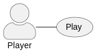

# Análise orientada a objeto
> [!NOTE]
> A **análise** orientada a objeto consiste na descrição do problema a ser tratado, duas primeiras etapas da tabela abaixo, a definição de casos de uso e a definição do domínio do problema.

## Descrição Geral do domínio do problema

A ideia inicial é criar um jogo de cartas com elementos de RPG, com ações baseadas em turnos e inimigos gerados de forma aleatória. 
A intenção é que o desenvolvimento do projeto possibilite a exploração abrangente das ferramentas disponibilizadas pela linguagem C++ e pelo paradigma de programação orientado a objetos.

#### Requisitos funcionais:
    - Manipular um deck de cartas permitindo ações de compra, adição, remoção e embaralhamento das cartas.
    - Criar inimigos de forma aleatória de acordo com a progressão.

## Diagrama de Casos de Uso

O projeto inicial possui como ator o **jogador** e como única funcionalidade a ação de **jogar.**

 
## Diagrama de Domínio do problema

Elaborar um diagrama conceitual do domínio do problema.

[Retroceder](README.md) | [Avançar](projeto.md)

