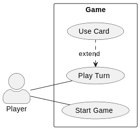
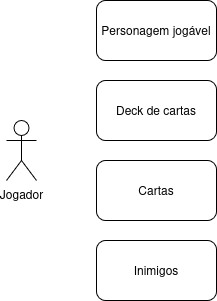

# Análise orientada a objeto
> [!NOTE]
> A **análise** orientada a objeto consiste na descrição do problema a ser tratado, duas primeiras etapas da tabela abaixo, a definição de casos de uso e a definição do domínio do problema.

## Descrição Geral do domínio do problema

A ideia inicial é criar um jogo de cartas com elementos de RPG, com ações baseadas em turnos e inimigos gerados de forma aleatória. 
A intenção é que o desenvolvimento do projeto possibilite a exploração abrangente das ferramentas disponibilizadas pela linguagem C++ e pelo paradigma de programação orientado a objetos.

#### Requisitos funcionais:
- Manipular um deck de cartas permitindo ações de compra, adição, remoção e embaralhamento das cartas.
- Criar inimigos de forma aleatória de acordo com a progressão.

## Diagrama de Casos de Uso

- **Caso de Uso 1:** [Start Game](./UML/Caso%20de%20Uso%201.md)
- **Caso de Uso 2:** [Play turn](./UML/Caso%20de%20Uso%202.md)
- **Caso de Uso 3:** [Use card](./UML/Caso%20de%20Uso%203.md)

## Diagrama de Domínio do Problema

Os principais elementos presentes no problema estão apresentados no diagrama, o jogador é o ator principal, usuário do sistema desenvolvido. Ele precisa de um personagem jogável e um baralho de cartas. Os inimigos são o elemento principal dos desafios que o jogador enfrentará.

[Retroceder](README.md) | [Avançar](projeto.md)

