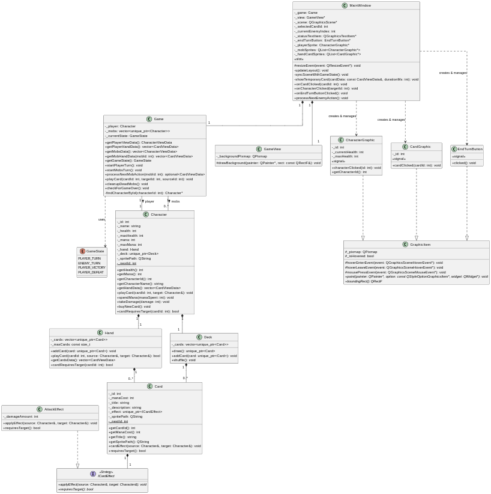

# Projeto orientado a objeto

>[!NOTE]
>O **Projeto orientado a objeto** é composto pelas documentação do projeto descrito em UML. Deve incluir um Diagrama de Classes do sistema projetado, e pelo menos um diagrama de interação de um dos casos de uso. Outros diagramas podem ser apresentados, caso julgue necessário.

## Diagrama de Classes
Classe "Game" cria a lógica inicial do jogo e gerencia os personagens envolvidos. 

Classe "Character" define o modelo para os personagens, tanto jogador quando inimigos.

Classe "Deck" cria a interface para manipulação das cartas durante a partida. 

Classe "Card" define o modelo para gerar as cartas que agregarão cada deck.

[Retroceder](analise.md) | [Avançar](implementacao.md)

